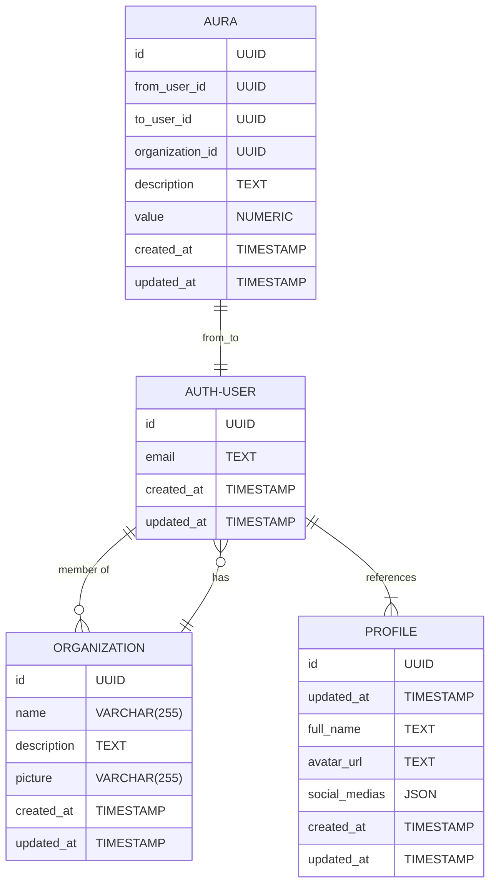

```mermaid
erDiagram
    AUTH-USER {
        id UUID
        email TEXT
        created_at TIMESTAMP
        updated_at TIMESTAMP
    }
    PROFILE {
        id UUID
        updated_at TIMESTAMP
        full_name TEXT
        avatar_url TEXT
        social_medias JSON
        created_at TIMESTAMP
        updated_at TIMESTAMP
    }
    ORGANIZATION {
        id UUID
        name VARCHAR(255)
        description TEXT
        picture VARCHAR(255)
        created_at TIMESTAMP
        updated_at TIMESTAMP
    }
     AURA {
         id UUID
         from_user_id UUID
         to_user_id UUID
         organization_id UUID
         description TEXT
         value NUMERIC
         created_at TIMESTAMP
         updated_at TIMESTAMP
    }

    AUTH-USER ||--o{ ORGANIZATION : "member of"
    ORGANIZATION ||--o{ AUTH-USER : "has"
    AUTH-USER ||--|{ PROFILE : "references"
    AURA ||--|| AUTH-USER : "from_to"
```
