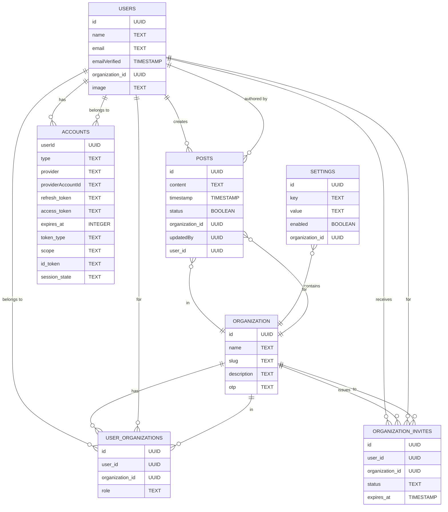
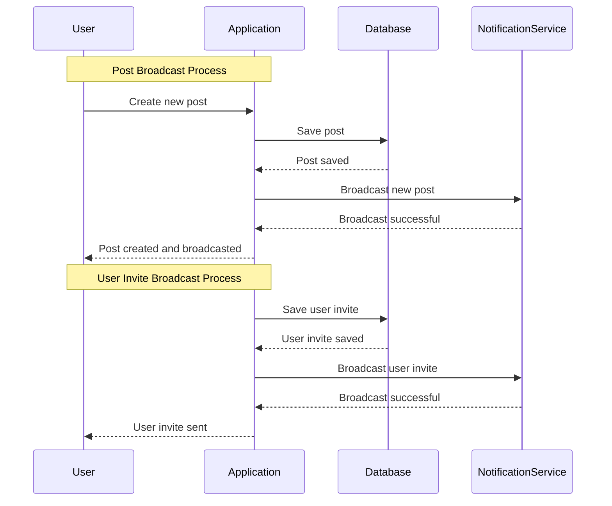

# About the Application

Task Circle is a task management application that allows users to create, manage and collaborate on tasks within an group.

## Application Schema and Processes

#### Entity-Relationship Diagram (ERD)

The following ERD illustrates the relationships between different entities in the application:

#### Cron Job Sequence Diagram

The following sequence diagram describes the cron job responsible for cleaning up expired organization invites:

<!-- mmdc -i README.mmd -o output.svg -->

### Broadcast Process Sequence Diagram

The following sequence diagram describes the process of broadcasting a new post to all users in an organization, and also the process of broadcasting invite status to users:

